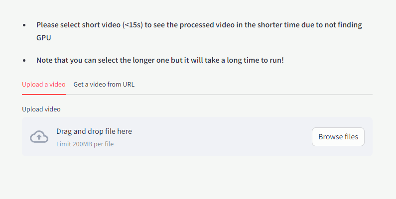
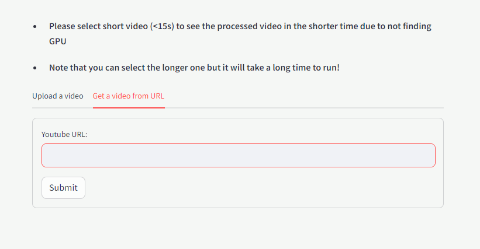
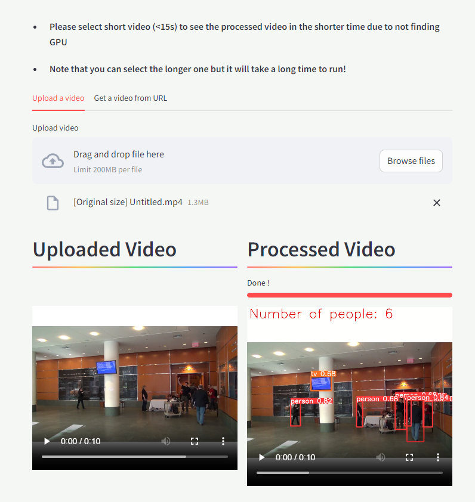

# Web-based Video Analytics System (VAS)

## Table of contents:
1. [Introduction](https://github.com/thompsondd/Web-based-Video-Analytics-System/blob/main/README.md#1-introduction)

2. [Project Detail](https://github.com/thompsondd/Web-based-Video-Analytics-System/blob/main/README.md#2-project-detail)

3. [Website Interface](https://github.com/thompsondd/Web-based-Video-Analytics-System/blob/main/README.md#3-website-interface)
   
4. [Demonstrations of Results](https://github.com/thompsondd/Web-based-Video-Analytics-System/blob/main/README.md#4-demonstrations-of-results)


## 1. Introduction
- **Project Focus**:
   - **Video Analytics System (VAS)**: The primary goal is to design and implement a Video Analytics System capable of processing video content from URLs or user uploads.

   - **Web Interface**: Develop a sleek web-based interface to facilitate data input and showcase visualized analysis outcomes.

- **Running System**:
   - Install dependencies of the project
   ```
   cd [YOUR PROJECT PATH]
   pip install -r requirements.txt
   ```
   - Run website interface
   ```
   cd [YOUR PROJECT PATH]
   streamlit run main.py
   ```
- **Accessing Results**: 
   - You can access all detailed results in my [OneDrive](https://uithcm-my.sharepoint.com/:f:/g/personal/20521159_ms_uit_edu_vn/EgRsm2lULAZGgPnSBl5f6DIB3ACk0cvPjidJLSTcYK0ctg?e=yvsRme) or my [playlist in Youtube](https://www.youtube.com/playlist?list=PLkZll_xtzt8rNelPKHMucVeOEtLTr5I_c) due to their large file sizes.
   - For a more condensed presentation, please visit the [demonstration section](https://github.com/thompsondd/Web-based-Video-Analytics-System/blob/main/README.md#4-demonstrations-of-results).

- For a deeper understanding of the project's structure, you're invited to explore the [Project Detail section](https://github.com/thompsondd/Web-based-Video-Analytics-System/blob/main/README.md#2-project-detail).

## 2. Project Detail

- **Output Video Information**:
   - **Real-time Object Count**: The video displays real-time object counting for both people and other objects in every frame, providing synchronized results as you watch.

   - **Visual Object Annotations**: The video features an interactive canvas that visually highlights detected objects. Each frame showcases bounding boxes around the objects, along with their corresponding names, all synchronized seamlessly with the video playback.

- **Technogies Using** :
   - **Streamlit**: The project use [_streamlit_](https://streamlit.io/) library to build the website. The source code is in file [main.py](./main.py) in the project.
   - **YOLO Models Family**: YOLO version 8 is used for detecting a person in each frame of video and visualizing their bounding box, before using OpenCV for concatenating processed frames as an output video including required information. The source code is in file [yolo.py](./yolo.py) in the project.


## 3. Website Interface
- When running the application, if GPUs are not detected, there will be lines of notifications at the head of the page.
### Upload from local
   
   

### Upload from URL
   
   

### Outputs visualization interface
   - The interface for visualizing the output remains the same, whether uploading a video from your local device or through a URL.
   
## 4. Demonstrations of Results

### Example Video
   
### Example URL 1
   
